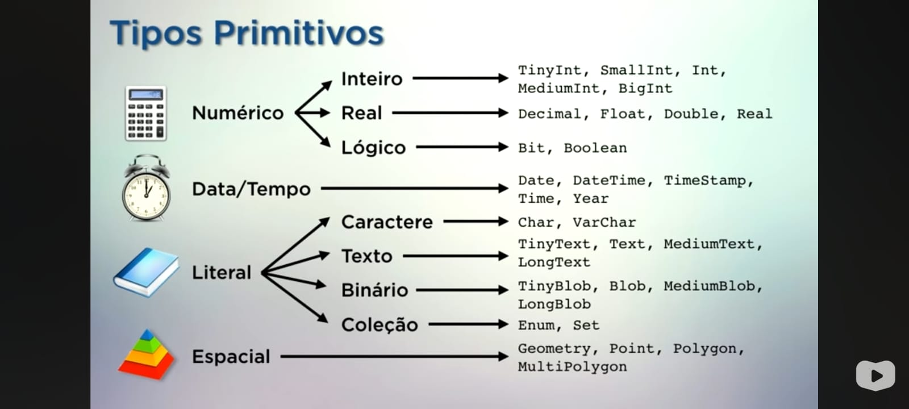

##

# SGBD: 💾💿🖥️🗂️🗃️🗄️

##
- 🧑‍💻 Curso em Vídeo:

https://youtube.com/playlist?list=PLHz_AreHm4dkBs-795Dsgvau_ekxg8g1r&si=Wa7SQf_OanD8ioRL

##

# 📌 TIPOS PRIMITIVOS:

##

# 📌 CRIANDO O BD:

##

create database meuBD

default character set utf8 

default collate utf8_general_ci;

##

# 📌 CRIANDO UMA TABELA:

##

create table minhatab(

item1 int not null auto_increment,

item2 varchar(20) not null,

item3 enum('M', 'F'),

item4 date,

item5 decimal(3,2),

item6 varchar(20) default 'Brasil',

primary key(item1)

) default charset=utf8;

##

# 📌 INSERINDO DADOS:

##

insert into minhatab  

(item1, item2, item3, item4, item5, item6) 

values 

('value1','value2', 'value3', 'value4', 'value5','value6'); 
 
##

# 📌 INSERINDO VÁRIOS DADOS:

##

insert into minhatab

(item1, item2, item3, item4, item5, item6) 

values 

('value1','value2', 'value3', 'value4', 'value5','value6'),

('value1','value2', 'value3', 'value4', 'value5','value6'),

('value1','value2', 'value3', 'value4', 'value5','value6'); 

##

# 📌 ADICIONAR COLUNAS: 

##

alter table minhatab 
add column nomecoluna tipoprimitivo; 

- Dessa forma a coluna sempre será adicionada ao fim da tabela; 

## 

##

# 📌 REMOVER COLUNAS: 

##

alter table minhatab

drop column nomecoluna; 

##

# 📌 POSIÇÃO ESPECÍFICA:

##

alter table minhatab 

add column nomecoluna tipoprimitivo after nomecoluna;

##

# 📌 PRIMEIRA COLUNA: 

alter table minhatab 

add column nomecolum tipoprimitivo first; 

##

# 📌 ALTERAR ESTRUTURA E DEFINIÇÃO:

alter table minhatab 

modify column nomecoluna varchar(EX:20); 

- Você consegue alterar o tipo primitivo e constrencts; 

##

# 📌 MODIFICAR NOME DA COLUNA:

## 

alter table minhatab 

change column nomecoluna EX: newcoluna varchar(20);

##

# 📌 RENOMEAR TABELA:

##

alter table minhatab 

rename to garfanhotos; 

##

# 📌 APAGAR TABELA:  

drop table nometabela; 

drop id exists nometabela; 

##

# 📌 MOSTRAR: 

##

- show databases; --> Para mostrar BD criados;

- use nomedoBD; --> abre o BD; 
 
- show tables; --> Mostra as tabelas existentes; 

- describe nomedatabela; --> Mostra a tabela; 

- select * from nometabela; --> Mostra todos os dados da tabela;

- status; --> verifica qual BD está aberto; 

##

# 📌 MANIPULAR LINHAS:

##

              ->  Apenas uma  <-

update nome tabela        
set nomeecoluna = "texto"

where id = "x";            

                -> Várias <-

update nome tabela                     
set nomecoluna = "texto", nome = "texto"  
where id = "x";             

## 

# 📌 DELETAR LINHAS:

delete from nometabela
where id = 'x'          

##

     

